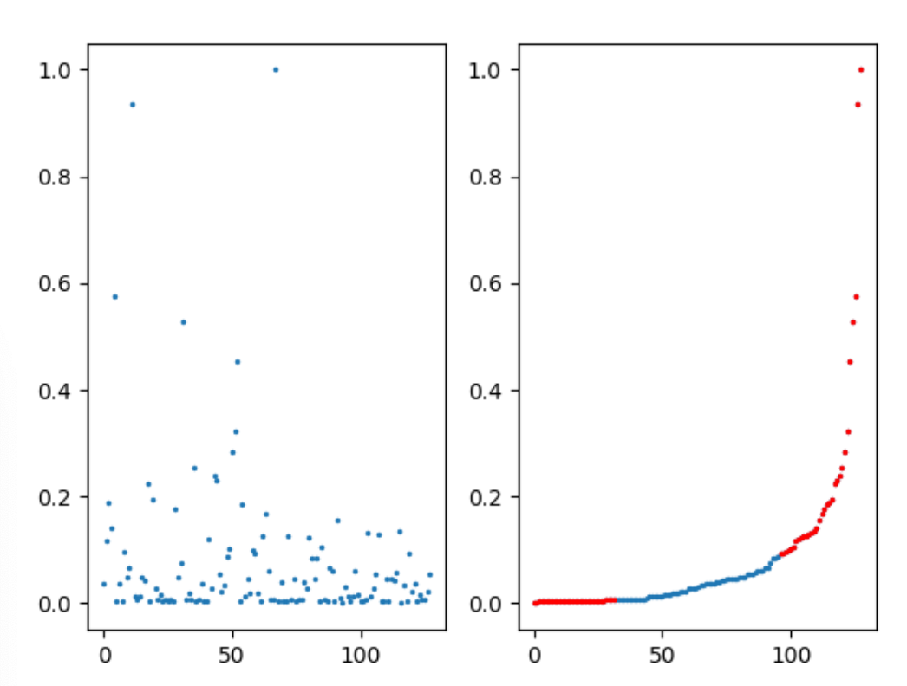

# Non-target Divergence Hypothesis: Toward Understanding Modality Differences in Cross-Modal Knowledge Distillation

## Synthetic Gaussian
Navigate to the `gauss` directory.

1. Use synthetic Gaussian data to gain intuition about NTDH.  
   Generate multimodal data (data generation inspired from [here](https://github.com/lopezpaz/distillation_privileged_information.git)) and apply cross-modal KD.

```bash
python main.py
```

---

## Synthetic sklearn
Navigate to the `sklearn` directory.

```bash
python main.py
```

---

## Synthetic MNIST
Navigate to the `MNIST` directory.

```bash
python main.py
```

---

## SemanticKITTI Lidar Semantic Segmentation
Navigate to the `semanticKITTI` directory.

### Code Structure
```
|--- semanticKITTI/
     |--- config_server_kitti.yaml   # Configuration file for SemanticKITTI dataset training
     |--- main.py                    # Main script
     |--- trainer.py                 # Teacher network training
     |--- trainer_student.py         # Student network training
     |--- option.py                  # Configuration parser
     |--- run.sh                     # Execution script (requires chmod +x permission)
```

### Steps
1. Modify `config_server_kitti.yaml`:  
   Set `data_root` to the actual dataset path. You may also change parameters such as `gpu` and `batch_size`.

2. Modify `run.sh`:  
   Ensure `nproc_per_node` matches the number of GPUs specified in the yaml config.

3. Run the training script:
```bash
./run.sh
# or
bash run.sh
```

4. After successful execution, experiment logs will be automatically generated under `PMF/experiments/PMF-SemanticKitti`.  
   Directory structure:
```
|--- log_dataset_network_xxxx/
     |--- checkpoint/   # Training checkpoints and best model
     |--- code/         # Code backup
     |--- log/          # Console logs and config copies
     |--- events.out.tfevents.xxx   # TensorBoard files
```

---

## NYUDepthV2 Semantic Scene Completion
Navigate to the `NYUDepthV2` directory.

### Data Preparation
- Download dataset from [SSCNet](https://github.com/shurans/sscnet).

Repackaged data includes:
```python
rgb_tensor   = npz_file['rgb']        # PyTorch tensor of color image
depth_tensor = npz_file['depth']      # PyTorch tensor of depth
tsdf_hr      = npz_file['tsdf_hr']    # Flipped TSDF, (240, 144, 240)
tsdf_lr      = npz_file['tsdf_lr']    # Flipped TSDF, (60, 36, 60)
target_hr    = npz_file['target_hr']  # Ground truth, (240, 144, 240)
target_lr    = npz_file['target_lr']  # Ground truth, (60, 36, 60)
position     = npz_file['position']   # 2D–3D projection mapping index
```

---

### Train and Test
1. Configure dataset paths in [config.py](https://github.com/waterljwant/SSC/blob/master/config.py#L9):
```python
'train': '/path/to/your/training/data'
'val': '/path/to/your/testing/data'
```

2. Train:  
   Edit [run_SSC_train.sh](https://github.com/waterljwant/SSC/blob/master/run_SSC_train.sh#L4), then run:
```bash
bash run_SSC_train.sh
```

3. Test:  
   Edit [run_SSC_test.sh](https://github.com/waterljwant/SSC/blob/master/run_SSC_test.sh#L3), then run:
```bash
bash run_SSC_test.sh
```

---

## RAVDESS Emotion Recognition
Navigate to the `ravdess` directory.

Dataset: [RAVDESS (Ryerson Audio-Visual Database of Emotional Speech and Song)](https://zenodo.org/record/1188976#.YG6fBy8RrUo).  

- **Teacher modality**: audio  
- **Student modality**: images  

We provide the data splits and preprocessed features [here](https://drive.google.com/drive/folders/1alZF_3UZtcmxa8yzTaKz7k3lxdOJykPn?usp=sharing).  
Save the folder as `ravdess/data`.

---

### Step 1: [Optional] Compute Saliency Vector
Use Algorithm 1 to compute the salience of modality-general decisive information for each feature channel.

```bash
python main_overlap_tag.py --place 5 --num-permute 10 --first_time --cal_tag
```

- `--place`: layer where multimodal features are input (default = 5, feature dim = 128)  
- `--num-permute`: number of permutations (M in Algorithm 1)  
- `--first-time`: trains unimodal networks first (step 1 in Algorithm 1)  

Generated files:
- Teacher checkpoint: `teacher_mod_1_overlap.pkl`
- Saliency vector: `overlap_tag_teacher_place{place}_repeat{num_permute}.npy`  
  (under `./results`)

Visualize saliency vector:
```bash
python utils/helper.py
```



- Normalized to `[0, 1]`  
- Larger values = more salient feature channels (contain modality-general decisive info)

---

### Step 2: Verify MFH Using Saliency Vector
```bash
# Mode 0 - randomly remove 75% of feature channels
python main_overlap_tag.py --ratio 0.75 --mode 0 --eval_tag

# Mode 1 - Modality-general KD: remove top %r channels with least modality-general info
python main_overlap_tag.py --ratio 0.75 --mode 1 --eval_tag

# Mode 2 - Modality-specific KD: remove top %r channels with most modality-general info
python main_overlap_tag.py --ratio 0.75 --mode 2 --eval_tag
```

**Expectation:** Modality-general KD (mode 1) will yield the best student network.
